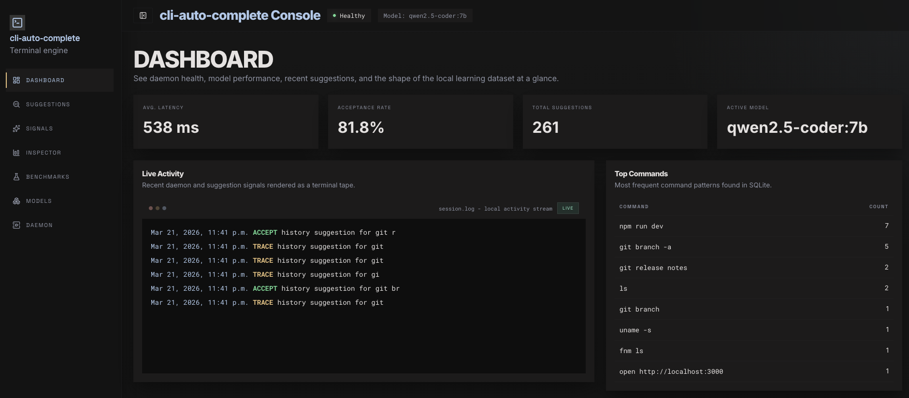
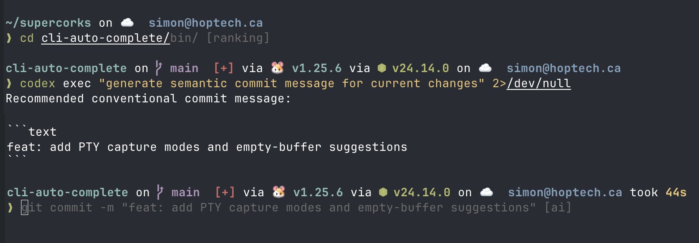
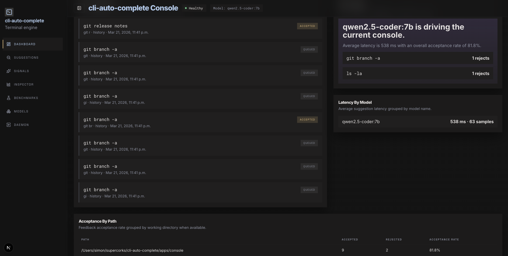
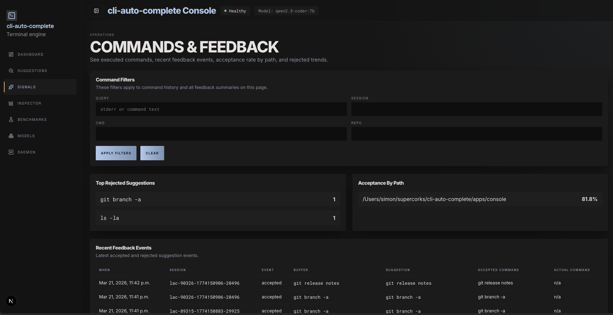
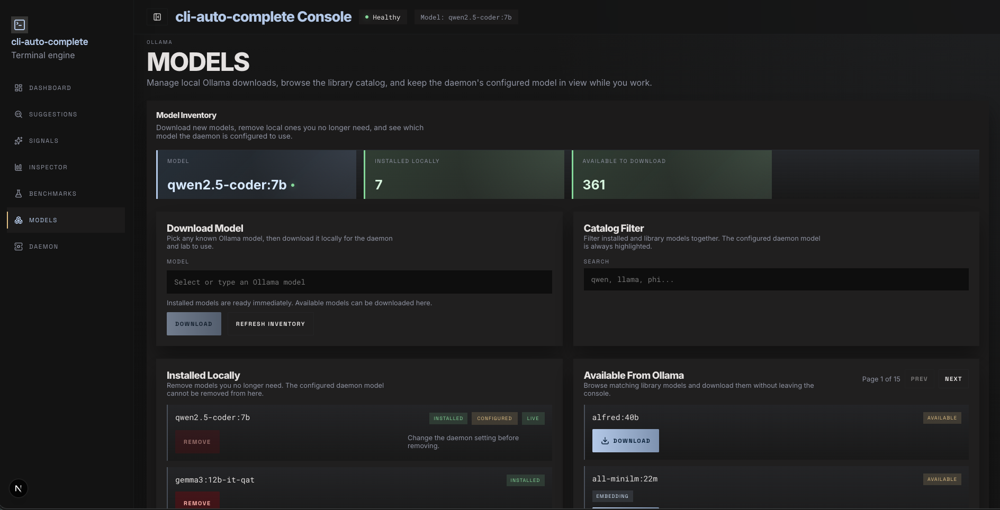
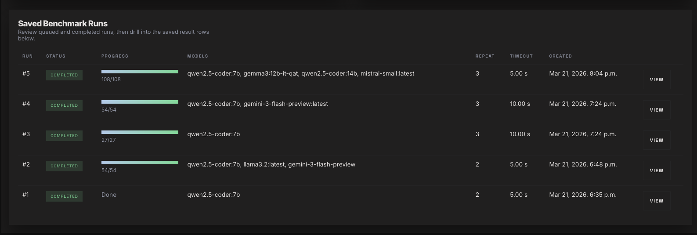
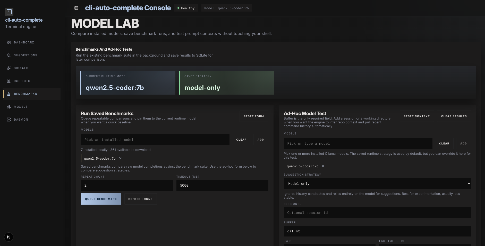
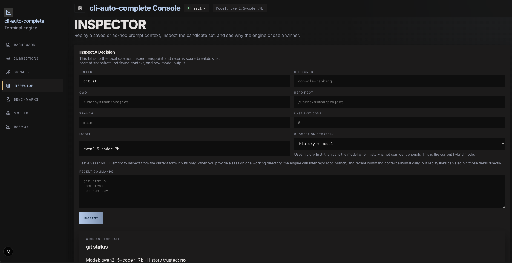

# llm-cli-suggestions

**Local-first, context-aware terminal autosuggestions for macOS `zsh`.**

Type a few characters and a ghost-text suggestion appears inline — press `Tab` to accept by default, or switch acceptance to Right Arrow in the daemon settings page. Suggestions are shaped by where you are and what you were just doing: current working directory, repo root, git branch, recent commands, last exit code, recent command output, and local project tasks. Everything runs on your machine: a Go daemon, a local Ollama model, and a SQLite learning loop. No cloud, no API keys, no telemetry.

<p align="center">
  
</p>

---

## Highlights

- **Ghost-text suggestions in zsh** — async, debounced, and non-blocking. Feels like IDE autocomplete but for your terminal.
- **Learns from you** — every command, acceptance, and rejection feeds back into ranking. The engine gets better the more you use it.
- **Context-aware** — suggestions factor in your current working directory, repo root, git branch, recent commands, last exit code, recent command output, local filesystem paths, and project tasks from files like `package.json`, `Makefile`, and `justfile`.
- **Local model inference** — ships with Ollama integration. Runs models like `qwen2.5-coder:7b` entirely on-device.
- **Full control app** — a local Next.js dashboard for analytics, inspection, benchmarking, model management, and daemon control.
- **Benchmark suite** — compare models head-to-head on your real prompt contexts and see which one actually works best for your workflow.

---

## Screenshots

### Suggestions in the terminal

Ghost-text completions appear inline as you type. Tab accepts by default, and the daemon settings page can switch acceptance to Right Arrow.

<p align="center">
  
</p>

### Dashboard

The local console keeps the live signal stream, recent suggestions, and path-level acceptance trends in one place.

<p align="center">
  
</p>

### Suggestion history

Browse every suggestion the engine has made, with timing, model, outcome, and full context snapshots.

<p align="center">
  
</p>

### Commands & feedback signals

Review executed commands, feedback trends, and command-level context without crowding the main table with full output excerpts.

<p align="center">
  
</p>

### Inspector

Replay any prompt context, inspect candidate scores, retrieval signals, and raw model output.

<p align="center">
  
</p>

### Model lab — benchmark and compare

Queue repeatable benchmark runs across multiple models, compare latency and acceptance, and drill into individual results.

<p align="center">
  
</p>

<p align="center">
  
</p>

<p align="center">
  
</p>

### Models — download and manage Ollama models

Browse the full Ollama library, download models, and switch the active daemon model without leaving the console.

<p align="center">
  
</p>

---

## Quick Start

### Prerequisites

- macOS with `zsh`
- [Go 1.21+](https://go.dev/dl/)
- [Ollama](https://ollama.com/) running locally with at least one model pulled (e.g. `ollama pull qwen2.5-coder:7b`)
- [Node 24+](https://nodejs.org/) (for the control app only)

### Install and run

```bash
git clone https://github.com/SuperCorks/llm-cli-suggestions.git
cd llm-cli-suggestions
make build
```

Start the daemon:

```bash
./bin/autocomplete-daemon
```

Load the zsh plugin:

```bash
source "$PWD/zsh/llm-cli-suggestions.zsh"
lac-start-daemon
```

For a persistent setup, use the absolute clone path in your `.zshrc` so it works from any directory:

```bash
source "/absolute/path/to/llm-cli-suggestions/zsh/llm-cli-suggestions.zsh"
lac-start-daemon
```

That's it — start typing and suggestions will appear.

---

## How It Works

```
You type → zsh plugin debounces helper → autocomplete-client → local daemon → ghost-text renders
                                                               │
                                         ┌─────────────────────┼─────────────────────┐
                                         │                     │                     │
                                   SQLite history         Local retrieval      Ollama model
                                   + feedback             (paths, branches,   (only when
                                   + prompt snapshots     tasks, output)      history is not
                                                                                 decisive)
                                         │                     │                     │
                                         └─────────────────────┼─────────────────────┘
                                                               │
                                                     Ranked blend → top suggestion
```

The suggestion engine blends signals from:

1. **Command history** — prefix matching with repo, branch, and cwd affinity scoring
2. **Local model** — Ollama inference with bounded timeout, only called when history isn't confident enough
3. **Retrieved context** — filesystem paths, git branches, project tasks (npm/make/just), and recent command output
4. **Feedback loop** — accepted suggestions get boosted, rejected ones get penalized

That means the same prefix can lead to different suggestions depending on where you are. `git ch` inside one repo can favor a branch that exists there, `npm run` can surface scripts from the current project, and a failed command can bias the next suggestion toward a likely fix.

The control app reads the same local state for analytics, inspection, benchmarking, runtime settings, and daemon operations.

---

## Configuration

The daemon uses sensible defaults:

| Setting | Default | Env var |
|---|---|---|
| Socket | `~/Library/Application Support/llm-cli-suggestions/daemon.sock` | `LAC_SOCKET_PATH` |
| Database | `~/Library/Application Support/llm-cli-suggestions/autocomplete.sqlite` | `LAC_DB_PATH` |
| Model | `qwen2.5-coder:7b` | `LAC_MODEL_NAME` |
| Ollama URL | `http://127.0.0.1:11434` | `LAC_MODEL_BASE_URL` |
| Ollama keep alive | `5m` | `LAC_MODEL_KEEP_ALIVE` |
| System Prompt | built-in shell autosuggestion prompt | `LAC_SYSTEM_PROMPT_STATIC` |
| Suggest timeout | `1200ms` | `LAC_SUGGEST_TIMEOUT_MS` |
| Accept key | `tab` | `LAC_ACCEPT_KEY` |

Settings saved from the control app persist to `runtime.env` and are picked up by new shells automatically.

---

## Control App

The local Next.js control app lives in `apps/console`:

```bash
cd apps/console
npm install
npm run dev
```

Open the local URL shown by Next.js to access the dashboard, suggestions, signals, inspector, models, model lab, and daemon controls.

The console app resolves its runtime paths from the standard state directory and persisted `runtime.env` by default, so it does not accidentally inherit stale `LAC_*` variables from the shell used to launch `next dev`. If you intentionally want to inspect or edit an alternate state dir or SQLite file through process env, also set `LAC_CONSOLE_USE_PROCESS_ENV_OVERRIDES=1`. Daemon start, stop, and restart still enforce a single active local daemon process at a time, so switching to an alternate state dir replaces the currently running daemon instead of running both in parallel.

The Daemon page also lets you edit the full system prompt used for shell autosuggestions, choose whether `Tab` or Right Arrow accepts a suggestion in new shells, and set the Ollama `keep_alive` value used to keep models warm between requests.

For a production build: `npm run build`. Run the e2e smoke suite with `npm run e2e`.

---

## Output Capture

The engine can use previous command output to make smarter suggestions (e.g. run `git branch`, then `git checkout` suggests an actual branch name).

- **PTY capture** — set `LAC_PTY_CAPTURE_MODE=allowlist` to wrap only selected commands, or `LAC_PTY_CAPTURE_MODE=blocklist` to wrap most external commands while excluding tools you do not want to run through the PTY helper. In the daemon UI, enter one exact command name or one `/regex/` per line in the allow-list or block-list. Plain lines match the executable name, while regex lines match the full command text, which is useful when the lightweight PTY shell can interfere with complex interactive CLI tools.
- **Auto capture** — set `LAC_AUTO_CAPTURE_ENABLED=1` for safe non-interactive commands (may affect color output)
- **Explicit** — `lac-capture <command>` or `lac-capture-pty <command>` for one-off capture

The control app Daemon page can persist the PTY capture mode plus newline-separated allow-list and block-list rules to `runtime.env` so new shells pick them up automatically.

---

## Inspect Logged Data

```bash
./bin/autocomplete-client inspect summary
./bin/autocomplete-client inspect top-commands --limit 15
./bin/autocomplete-client inspect recent-feedback --limit 20
```

---

## Tests

```bash
make test               # Go unit tests
make smoke-shell        # Zsh integration smoke test
make bench-models       # Model benchmark suite
cd apps/console && npm run typecheck && npm run lint && npm run build && npm run e2e
```

Compare multiple models:

```bash
./bin/model-bench -models qwen2.5-coder:7b,gemma3:12b-it-qat,mistral-small
```

---

## Current Status

This is an actively developed personal project. The engine, control app, and shell integration are functional and used daily. The biggest remaining areas are quality tuning, richer eval loops, and shell UX hardening.
